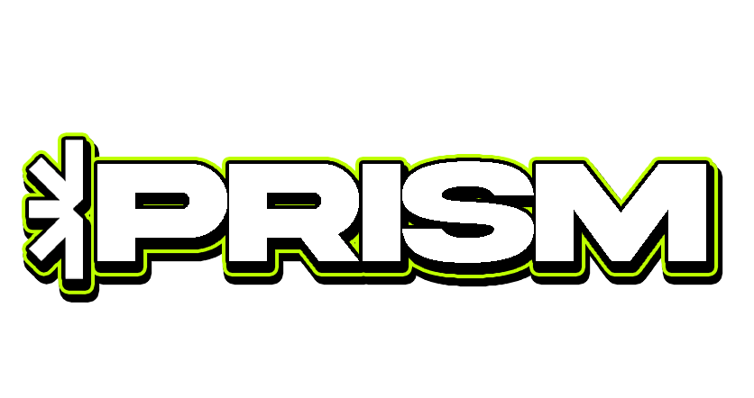

<div align="center">
  
  <h1>PRISM ✦ AI Content Engine for Dev Communities</h1>
  <p><strong>Automated GitHub PR Ingestion • Omni-Channel Release Suite • 5-Slide Visual Carousels • Community Hype Kits (.zip)</strong></p>
</div>

---

## 🎨 Design System & Visual Identity

Prism strictly adheres to a friendly, modern design aesthetic blending clean typography with distinct color blocking and vector accents:

| Token | Hex / Value | Description |
| :--- | :--- | :--- |
| **Background** | `#F7F7F5` | Warm light cream canvas background |
| **Primary Accent** | `#3B28CC` | Electric blue for primary actions & slide highlights |
| **Secondary Highlight** | `#D4FF33` | Energetic lime green for CTA badges & text highlights |
| **Text** | `#1A1A1A` | Deep charcoal for high contrast readability |
| **Buttons** | `rounded-full` | Heavy pill-shaped buttons with directional arrow `↗` badges |
| **Cards** | `rounded-3xl` | Distinct 2XL/3XL cards with subtle borders (`border-gray-300`) |
| **Accents** | `✦` | Vector 8-point asterisks to punctuate negative space |

---

## ⚙️ System Architecture

```
 ┌────────────────┐     ┌────────────────┐     ┌────────────────┐
 │    THE BEAM    │ ──> │   THE CANVAS   │ ──> │  WAVELENGTHS   │
 │ GitHub PR / Diff│     │ Live AI Engine │     │ Social & Slides│
 └────────────────┘     └────────────────┘     └────────────────┘
         │                      │                      │
         ▼                      ▼                      ▼
 ┌────────────────┐     ┌────────────────┐     ┌────────────────┐
 │   THE VAULT    │     │   REACT BITS   │     │    SCATTER     │
 │ AES-256 Keys DB│     │  Curved & Blur │     │ JSZip Packager │
 └────────────────┘     └────────────────┘     └────────────────┘
```

### 1. 🔐 "The Vault" (AES-256 Encrypted Key & Social OAuth Engine)
- **Live Key Verification**: Real-time HTTP verification ping against OpenAI, Anthropic, Replicate, and fal.ai APIs before storing.
- **Encryption**: Node.js `crypto` module (AES-256-GCM) encrypts keys in SQLite (`dev.db`) using Prisma ORM v7 with `@prisma/adapter-better-sqlite3`.
- **Social OAuth Integration**: Connects Discord Webhooks, X (Twitter) OAuth, and LinkedIn Organization tokens with live popups.

### 2. ⚡ "The Beam" (Live PR & Diff Extraction)
- Ingests GitHub PR URLs (`https://github.com/owner/repo/pull/123`) or raw technical notes.
- Uses GitHub REST API to fetch PR title, body, author, and raw `.diff` payload.

### 3. 🎨 "The Canvas" (Real Streaming AI Engine)
- Formats technical diffs into structured release kits using Vercel AI SDK (`@ai-sdk/openai`, `@ai-sdk/anthropic`).
- Generates 5 Instagram visual carousel slides with custom brand styling and code highlight blocks.

### 4. 📢 "Wavelengths" & "Scatter" (Omni-Channel & Zip Packager)
- **Instagram Carousel**: Horizontal 5-slide viewer with live text/code editing.
- **X/Twitter & LinkedIn**: Technical thread and executive post copy with character counters.
- **Discord**: Formatted markdown release with direct webhook broadcasting (`/api/wavelengths/publish`).
- **Scatter Exporter**: 1-click `JSZip` utility packaging copy, slide assets, and instructions into a downloadable `.zip` file.

---

## 🚀 React Bits Components Integrated

- **`<CurvedLoop />`**: Marquee effect rendering text along a curved path across section headers.
- **`<GradualBlur />`**: Backdrop blur gradient overlay attached to bottom navigation and footer containers.

---

## 💻 Quick Start & Setup

### 1. Clone & Install
```bash
git clone https://github.com/your-username/prism.git
cd prism
npm install
```

### 2. Setup Environment Variables (`.env`)
```env
DATABASE_URL="file:./dev.db"
ENCRYPTION_SECRET="prism_secure_vault_secret_32bytes_key!!"
NEXTAUTH_SECRET="prism_nextauth_secret_key_123456789"
NEXTAUTH_URL="http://localhost:3000"
```

### 3. Sync Database & Run
```bash
npx prisma db push
npm run dev
```

Open [http://localhost:3000](http://localhost:3000) to view Prism.

---

## 🛡️ License

MIT License. Designed with ✦ by the Prism Core Dev Team.
